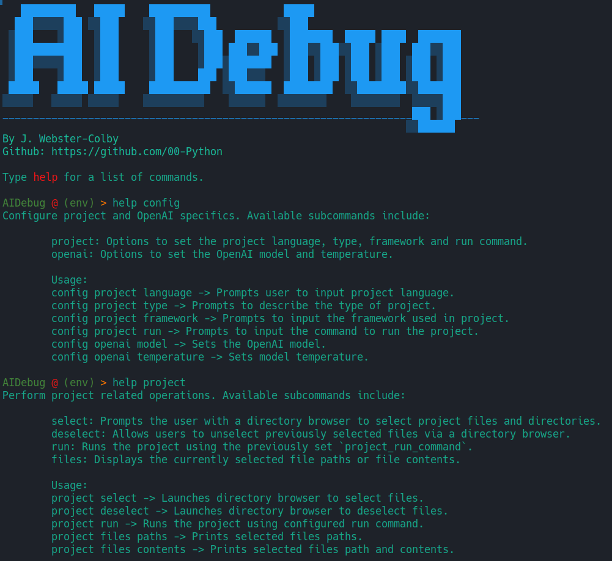

# AIDebug Console

https://github.com/00-Python/AI-Debug/assets/8343312/c8425e57-f1b4-499e-a838-d5d3aa4ba12d



AIDebug Console is a Python-based command line application that leverages the power of OpenAI's GPT models to assist with debugging and developing software projects. It provides a user-friendly interface for interacting with your codebase, running your project, and even debugging your code with the help of AI.

## Features

- **Project Management**: Select and deselect project files and directories.
- **Project Configuration**: Configure specific project details such as language, type, framework, and run command.
- **Code Execution**: Run your project directly from the console. (Automatically catches errors and asks user if they want to debug)
- **AI Debugging**: Debug your project with the help of OpenAI's GPT Models.
- **AI Feature Request**: Request a feature for your project from OpenAI's GPT Models.
- **AI Code Documentation**: Get a README.md file for your project's GitHub repository.

## Installation

1. Clone the repository to your local machine.
2. Navigate to the project directory.
3. Install the required Python packages using pip:

```bash
pip install -r requirements.txt
```

4. Set the necessary environment variables. You need to provide your OpenAI API key:

```bash
export OPENAI_API_KEY=your_openai_api_key
```

## Usage

1. Run the script:

```bash
python aidebug.py
```

2. Use the `help` command to see a list of available commands.

## Environment Variables

- `OPENAI_API_HOST`: The API host for OpenAI. Default is `https://api.openai.com`.
- `OPENAI_API_KEY`: Your OpenAI API key.

# Commands
Here is a brief explanation of the commands available in the AIDebug Console:

- `cd <directory>`: Change the current working directory.
- `exit`: Exit the AIDebug Console.
- `project select`: Select project files and directories.
- `project deselect`: Unselect files and directories by id.
- `project run`: Run the project.
- `project files paths`: Prints selected files paths.
- `project files contents`: Prints selected files path and contents.
- `config project language <language>`: Set the programming language of your project.
- `config project type`: Set the type of your project.
- `config project framework`: Set the framework that your project is using.
- `config project run <command>`: Set the command used to run your project.
- `config openai model <model>`: Set the OpenAI model to be used.
- `config openai temperature <temperature>`: Set the OpenAI model's temperature.
- `debug <error>`: Debug your project with the help of OpenAI's GPT Models.
- `feature <feature_request>`: Request a feature for your project from OpenAI's GPT Models.
- `readme <optional_message>`: Request a README.md file for your project's GitHub repository from OpenAI's GPT Models.

Remember to replace `<directory>`, `<language>`, `<command>`, `<model>`, `<temperature>`, `<error>`, `<feature_request>`, and `<optional_message>` with your actual values.

## Running System Commands

AIDebug Console allows you to run native system commands directly from the shell. Simply input the desired command, and it will be executed in the console.

For example, to list the files in the current directory, you can use the command `ls`:

```
> ls
```

This feature provides flexibility and convenience for running various system tasks alongside your project debugging and development.

## Credits

This project has borrowed code from [TheR1D's shell_gpt project](https://github.com/TheR1D/shell_gpt/blob/main/sgpt/client.py). I would like to express my gratitude for the contribution to the open-source community which has greatly aided the development of this project.

## Contributing

Pull requests are welcome. For major changes, please open an issue first to discuss what you would like to change.

## License

This project is licensed under the GNU v3 GPL-3.0 License. See the [LICENSE](LICENSE) file for details.